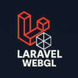
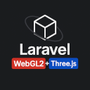

<p align="left">
    
</p>

<p align="left">
    
</p>

# Laravel WebGL2 + Three.js 3D Model Viewer

### A clean, lightweight WebGL2/Three.js project to upload, view, and interact with `.obj`, `mtl`, `gltf`, `glb`, `dae` 3D models directly in the browser built with **Laravel 12.12**, **PHP 8.3**, and **jQuery**, running inside **Docker**. WebGL2 includes zoom, rotate, lighting, camera memory, screenshots, screenshot gallery and more!

## Features

- Upload and render `.obj` 3D models  
- Zoom and rotate with mouse interactions  
- Center and scale models to fit the view automatically  
- Lighting
- Persistent camera memory using `localStorage` (restores last view on reload)
- Capture and download WebGL2 screenshots
- Flash messages and upload validation
- Dockerized for cross-platform compatibility (Windows/macOS/Linux)


## Technology Stack

| Layer        | Tech                                                  |
| ------------ |-------------------------------------------------------|
| Backend      | Laravel 12.12 (PHP 8.3)                               |
| Frontend     | HTML5 + jQuery + WebGL2 (via raw WebGL API) + ThreeJs |
| Rendering    | GLSL shaders (vertex & fragment), OBJ parser          |
| Build/Deploy | Docker (PHP-FPM, Nginx, MySQL)                        |
| Storage      | Laravel's `public` disk (symlinked)                   |


## Prerequisites

- **Docker Desktop** (Windows/macOS) OR Docker Engine (Linux)
- (Optional) Git & Composer (for manual work outside Docker)

## Setup: Run via Docker

**Clone the repo:**

```bash
git clone https://github.com/adorjan-szasz/webgl-viewer.git

cd webgl-viewer
```

#### Set up environment:
```bash
cp .env.example .env

APP_NAME=webgl_viewer
APP_ENV=local

DB_CONNECTION=mysql
DB_HOST=mysql
DB_PORT=3306
DB_DATABASE=webgl_viewer
DB_USERNAME=
DB_PASSWORD=

SESSION_DRIVER=file
SESSION_LIFETIME=120
SESSION_ENCRYPT=false
SESSION_PATH=/
SESSION_DOMAIN=null

FILESYSTEM_DRIVER=public
```

#### Start containerized environment:
```bash
docker-compose up -d --build
```
#### Enter container

```bash
docker exec -it laravel_app bash
```

#### Install Laravel & generate key & run migrations inside container:

```bash
composer install
php artisan key:generate
php artisan migrate
```

#### Create storage symlink:
```bash
mkdir -p storage/app/public/models
mkdir -p storage/app/public/screenshots

chmod -R 775 storage/app/public/models
chown -R www-data:www-data storage/app/public/models

chmod -R 775 storage/app/public/screenshots
chown -R www-data:www-data storage/app/public/screenshots

php artisan storage:link
```

#### Visit the app at: http://localhost:8000


## Difference between raw WebGL2 and Three.js

| Feature               | Raw WebGL2                                     | Three.js                                                  |
|-----------------------|------------------------------------------------|-----------------------------------------------------------|
| Abstraction level     | Very low-level, verbose API                    | High-level, user-friendly abstraction over WebGL          |
| Ease of use           | Steep learning curve                           | Easier with built-in objects, loaders, controls, lighting |
| Scene graph           | You have to build everything manually          | Comes with scene management, object hierarchy, etc.       |
| Built-in loaders      | None                                           | Yes (OBJ, GLTF, textures, etc.)                           |
| Animations & lighting | You write all shaders and matrix math yourself | Comes with default materials, lights, shadows             |
| Best for              | Fine-grained GPU control                       | Rapid 3D prototyping, games, architecture, visualization  |

## Usage

### Upload a Model (WebGL2)

Click "Choose File" and select a .obj file. Drag&Drop works too!

Click "Upload".

Your model will be centered, scaled and displayed.

### Upload Model(s) (ThreeJS)
Click "Choose File" and select one or more supported files. Drag&Drop also works!

Click "Upload".

Your model will be displayed.

### Interactions

- Rotate: Left-click & drag
- Zoom: Scroll wheel
- Reset View: Click the "Reset Camera" button

- Select models from already uploaded files

### Memory (implemented for WebGL2 for now)

#### Your camera view (zoom, rotation) is saved and restored between reloads.

### Screenshots (implemented for WebGL2 for now)

- Browse uploaded screenshots 
- Download or delete images

### Notes
.obj files should include normals (vn) and faces in f v//vn format.

Uploaded models are stored in storage/app/public/models/ and accessible at /storage/models/....

## Author
### Made by Adorján Szász
#### Feel free to fork, modify, or build upon this mini-project.

### License
#### MIT – Free to use and modify.


